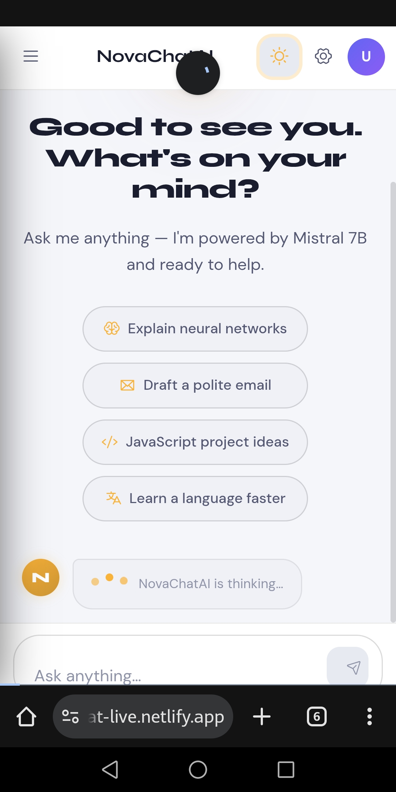
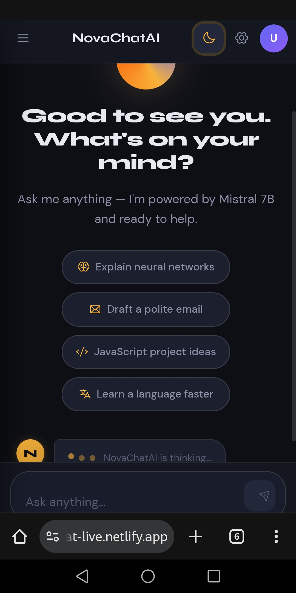
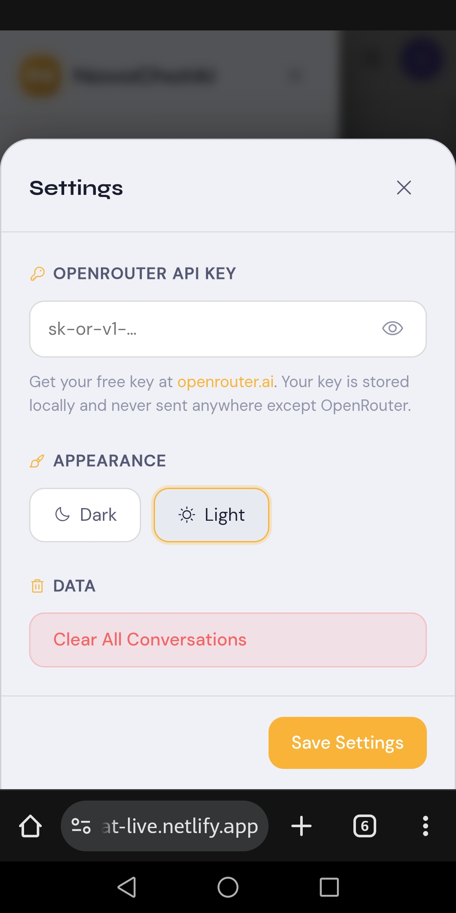
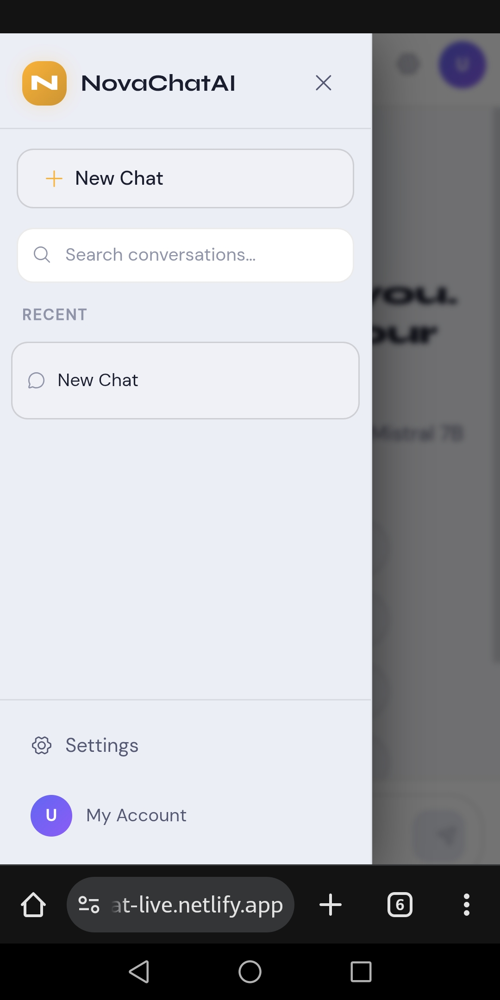

# NovaChatAI 🤖

NovaChatAI is a modern AI-powered chat application built using HTML, CSS, and JavaScript. It integrates the OpenRouter API to provide real-time AI responses.

---

## 🚀 Features

- AI chat using OpenRouter API
- Multi-chat history system
- Dark/light theme toggle
- LocalStorage persistence
- Settings panel
- Copy message feature
- Typing indicator
- Responsive UI

---

## 🛠️ Tech Stack

- HTML5
- CSS3
- Vanilla JavaScript
- OpenRouter API

---

## 📸 Preview

### 🟢 Main Chat Interface

### 🌙 Dark Mode

### ⚙️ Settings Panel

### 💬 Sidebar Chats
 

---

## 📌 Purpose

This project was built to demonstrate frontend development skills, API integration, and interactive UI design.

---

## 🚀 Future Improvements

- User authentication system
- Cloud chat storage (Firebase/Supabase)
- AI model switching
- Voice input support
- Better animations and UI polish
- File and image uploads
- Export chat feature
- Improved mobile responsiveness
- Performance optimizations
- Custom themes and personalization 

##  Repository link 
https://github.com/japhet996sunday-cell/Novachat-ai

##  live Demo
https://novachat-live.netlify.app/

## 👨‍💻 Author

Japhet Sunday 
